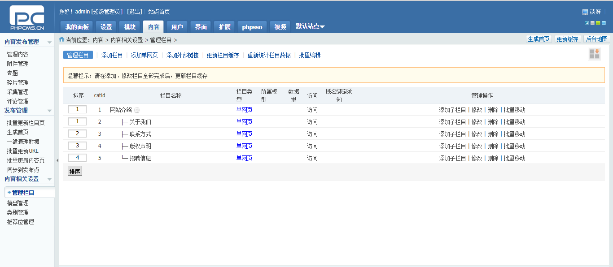
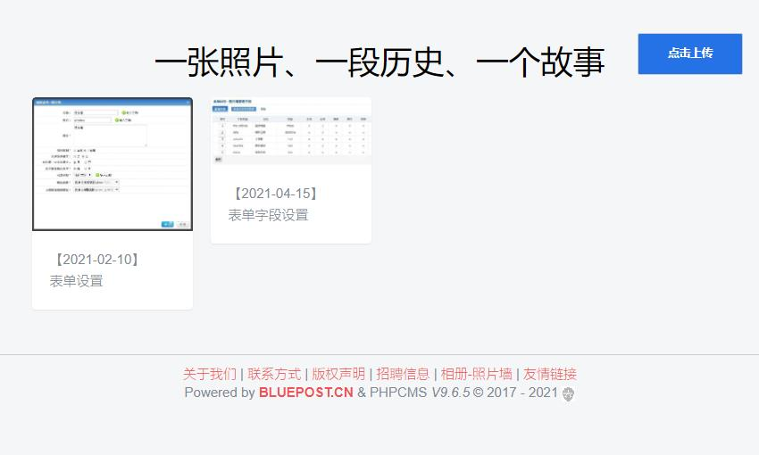

# phpcms  

## 一、介绍

这是已经安装好的phpcms模板
网站代码存放位置：/phpcms_code
数据库存放位置：/phpcms_db.sql
>**数据库名：** phpcms_db 
>**链接数据库用户名：** root 
>**链接数据库密码：** 空
>
>后台登陆地址：http://phpcms.com/admin.php 
>后台登陆用户名：admin 
>后台登陆密码：admin123
>
>登陆后台可以更改域名网址、密码

## 二、关联字段用法

>比如在产品案例(表名：v9_product_case)中添加了使用产品字段(字段名：use_product) 
>字段use_product设置项为 **字段类型**：关联字段，**关联表名**：v9_product，**主键**：id，**赋值字段和like字段**：title，**存入数据方式**：多选ID存入 
>那么在产品案例前端页面调用使用产品字段的用法如下；

    {php $use_product = str_replace('|',',',$use_product);}
    {pc:get sql="SELECT url,thumb,title FROM v9_product AS p WHERE p.id in($use_product)" return="data_product"}
    {loop $data_product $rp}
      

        <a href="{$rp[url]}" target="_blank" title="{$rp[title]}">
           
          {$rp[title]}
        </a>
      

    {/loop}
    {/pc}

## 三、照片墙功能：游客也可以上传修改方法

>1.phpcms\modules\attachment\attachments.php文件第22行注释掉。内容为：

    if(empty($this->userid)){
        //showmessage(L('please_login','','member'));
    }

>2.修改数据库，将数据表v9_member_group中游客角色的allowattachment字段由0更改为1。

【后台界面】
 

## 发布版本

### 版本：v9.7.0 (更新时间：2021-04-19 10:13)

    1. 由于phpcms官方不再维护，取消后台update远程链接和help帮助获取；
    2. 增加单文件上传和关联字段补丁文件；
    3. 添加photos_wall_demo文件夹（照片功能操作截图）

 

### 版本：v9.7.0 (更新时间：2021-04-16 17:20)

    1. 添加功能：照片墙（利用已有表单开发扩展，显示方式：瀑布流）
    2. 添加照片墙功能补丁文件

### 版本：v9.6.5_photos_wall (更新时间：2021-04-16 17:20)

    1. 添加功能：照片墙（利用已有表单开发扩展，显示方式：瀑布流）

### 版本：v9.6.5 (更新时间：2021-04-16 15:20)

    1. 添加功能：新增单文件上传字段、关联字段
    2. 关联字段可用于增加类似相关文章功能等，妙用很多，期待你的发现

### 版本：v9.6.4 (更新时间：2021-04-15 10:20)

    1. 修复php7.4以后版本支持bug（get_magic_quotes_gpc）
    2. 修复bug：在添加或编辑文章内容时，会将文章所属栏目直接生成5个列表静态页面文件(而未考虑文章不足５页)
    3. 修改 添加工作流后，待审核文章也可修改；修复审核时状态status无法改变，及更新栏目静态页和首页

### 版本：v9.6.3 (更新时间：2021-04-13 11:20)

    1. 修复https的bug，主要修复遗漏的http验证
    2. 修复mysqli连接数据库bug："continue" targeting switch is equivalent to "break". Did you mean to use "continue 2"? | phpcms\libs\classes\db_mysqli.class.php | 245
    3. 修改后台登陆界面

### 版本：v9.6.3 (更新时间：2019-03-21 11:20)

介绍
>该仓库是在phpcms v9.6.3的镜像基础上进行维护的。
>由于各种原因phpcms官方几乎不再维护，而大量的phpcms用户面临着各种bug风险。
>现在我们建立此仓库提供bug修复、新模块、新插件，继续让phpcms在网站开发建设的路上发光发热，紧跟时代步伐。

更新

    1.支持https
    2.支持PHP7
    3.修复阅读收费失效的问题
    4.修复高版本MySQL环境下的安装问题
    5.修复发布内容时绕过审核的漏洞
    6.修复文件包含漏洞
    7.修正动态或伪静态下分页不存在时未输出404的问题
    8.修复联动菜单在全站更新缓存后显示出错的问题
    9.【中危】修复利用伪造模板名称生成任意脚本的漏洞
    10.修复利用构造referer的xss攻击
    ......

 